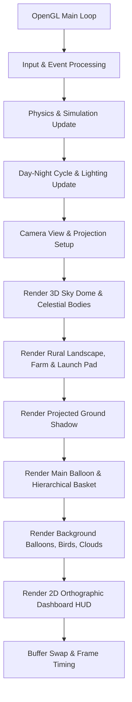

# Hot Air Balloon: A Floating 3D Sky Scene
## Project Implementation Plan & Technical Architecture

**Author:** Md. Tariful Islam Jony (2107119)  
**Course:** CSE 4101 (Computer Graphics Lab)  
**Platform:** C++17, OpenGL 3.3+ Core Profile, GLFW, GLAD, GLM (MinGW-W64 GCC)  

---

## 1. Executive Summary & Feasibility Confirmation

### Can We Build This Project?
**YES, absolutely 100%.**  
All requested features—including the parametric hot air balloon, rural meadow landscape, launch platform, windsock, clouds, flapping birds, multi-source Phong lighting, day-to-night cycle, dynamic ground shadow, 4-mode camera system, and orthographic dashboard HUD—can be built with top-tier visual fidelity and 60+ FPS performance using modern OpenGL (Core Profile 3.3).

### Key Architectural Strengths
1. **Procedural Geometry Engine:** Clean, mathematically defined 3D meshes (parametric teardrop envelope with vertical gores, wicker basket, conical windsock, low-poly pine & deciduous trees, rural barn/cottage, windmill, segmented bird wings, and volumetric cloud clusters). No bulky third-party 3D model loaders or external asset dependencies needed.
2. **Modular C++17 Architecture:** Clean separation into dedicated modules (`Shader`, `Camera`, `Mesh`, `ModelGenerator`, `Lighting`, `Scene`, `HUD`) instead of a single fragile monolithic file.
3. **Hardware-Accelerated Lighting & Shaders:** Custom GLSL shaders supporting the complete Phong lighting model with Directional Sun/Moon, Point Burner Light, Pad Spotlight, and Sky/Ground Ambient Bounce.
4. **Smooth Physics & Hierarchies:** Proper matrix stack / scene graph transformations for parent-child relations (Balloon $\to$ Basket sway $\to$ Burner $\to$ Flame; Bird Body $\to$ Left/Right Flapping Wings; Windsock Pole $\to$ Yaw Swivel $\to$ Tilt Cone).

---

## 2. Coordinate System, Projections & Conventions

- **World Coordinate Space:**
  - $+Y$: Up (Altitude / Height)
  - $+X$: Right / East (Wind Drift axis)
  - $+Z$: Forward / South (Depth / Horizon)
- **Projections:**
  - **3D Scene:** Perspective Projection ($FOV = 45^\circ$, Near $= 0.1$, Far $= 1000.0$).
  - **Dashboard HUD:** 2D Orthographic Projection ($[0, \text{Width}] \times [\text{Height}, 0]$) rendered with depth testing disabled and alpha blending enabled.



---

## 3. Detailed Scene & Object Specifications

### A. The Main Hot Air Balloon (Hierarchical Rig)
1. **Envelope:**
   - Procedural teardrop / inverted-pear mesh generated by revolving a cubic Bézier profile curve.
   - Alternating vertical colored gore panels (classic vivid balloon colors: crimson red, gold, royal navy, and crisp white).
   - Bottom throat collar with heat-resistant metallic rim.
2. **Burner Unit & Animated Flame:**
   - Metallic gimbal frame mounted above the basket.
   - Procedural 3D flame cone with dynamic vertex displacement and noise-based flicker.
   - Emits an internal flickering warm orange/yellow point light illuminating the envelope interior.
3. **Connecting Support Ropes:**
   - High-tensile rigging cables connecting the burner suspension ring to the four corners of the wicker basket.
4. **Woven Basket:**
   - Rectangular wicker basket with chamfered corners, woven panel textures/bands, corner support poles, and a top padded handrail.
5. **Hierarchical Sway Physics:**
   - Damped harmonic pendulum oscillation:
     $$\theta(t) = A \cdot \sin(\omega t) \cdot e^{-\gamma t} + \text{tilt}_{\text{wind}}$$
   - The basket gently sways beneath the envelope in response to wind gusts and vertical ascent.

### B. Secondary Background Balloons
- Two independent balloons of varying scales (e.g., $0.6\times$ and $0.4\times$) positioned at different altitudes and horizontal distances.
- Distinct color patterns (e.g., emerald green/yellow and sunset orange/violet).
- Independent drift trajectories demonstrating decoupled transformation hierarchies and providing atmospheric depth.

### C. Surrounding Rural Landscape & Launch Pad (User Highlighted)
- **Meadow / Terrain Ground Plane:**
  - Expansive rural meadow ($200 \times 200$ units) with subtle terrain rolling hills.
  - Natural grass color variations (rich meadow green with warm earthy undertones).
  - Winding dirt access road leading from the rural road to the launch pad.
- **Launch Platform:**
  - Raised octagonal or rectangular wooden deck with weathered timber planks.
  - Perimeter rustic post-and-rail wooden fence with an open entry gate.
  - Launch pad floodlight post for nighttime illumination.
- **Rotating Windsock:**
  - Mounted on a tall metal mast at the launch site.
  - Swivel collar rotating dynamically on the $Y$-axis according to the wind direction vector.
  - Segmented conical fabric sock (red-and-white stripes) drooping at low wind speed and extending horizontally/fluttering with higher wind speeds.
- **Rural Countryside Elements:**
  - **Low-Poly Trees:** Scattered evergreen conifers (layered conical foliage) and broadleaf deciduous trees (nested round foliage clumps) with woody trunks.
  - **Countryside Barn / Farm Cottage:** Low-poly timber cottage with pitched terracotta/slate roof, wooden beam details, and stone chimney.
  - **Rustic Country Windmill:** Traditional rural windmill with slowly rotating lattice blades.
  - **Fences & Details:** Wooden split-rail fences bordering the meadow, hay bales in the fields, and scattered decorative boulders.

### D. Atmospheric Sky & Fauna
- **Drifting Clouds:** Procedural cumulus clusters assembled from grouped flattened ellipsoids drifting across the sky and wrapping around world boundaries.
- **Flock of Flapping Birds:** Small flock (5–7 birds) flying in a dynamic V-formation.
  - Hierarchical structure: Bird Body $\to$ Left Wing (hinge rotation around local $Z$) + Right Wing (hinge rotation around local $Z$).
  - Realistic sinusoidal wing flapping motion synchronized with flight banking.
- **Celestial Cycle:** Sun disc and Moon disc traversing a spherical arc over time.

---

## 4. Multi-Source Lighting & Shading Model

The project implements a complete **Phong Reflection Model** ($I = I_a + I_d + I_s$) across four distinct light types:

```
  Light Source                     Role & Behavior
┌───────────────────────────────┬────────────────────────────────────────────────────────┐
│ 1. Directional Sun / Moon     │ Primary celestial light. Color transitions from golden │
│                               │ sunrise -> crisp daylight -> amber sunset -> moonlit   │
│                               │ silver. Direction vector orbits over time.             │
├───────────────────────────────┼────────────────────────────────────────────────────────┤
│ 2. Point Light (Burner Flame) │ Located in the throat of the balloon. Emits warm       │
│                               │ orange/yellow light that flickers with flame intensity,│
│                               │ casting a cozy glow onto the envelope and basket.      │
├───────────────────────────────┼────────────────────────────────────────────────────────┤
│ 3. Spotlight (Launch Pad)     │ Mounted on the launch pad mast pointing downwards with │
│                               │ cutoff and falloff cone, illuminating the platform.    │
├───────────────────────────────┼────────────────────────────────────────────────────────┤
│ 4. Two Area / Ambient Fills   │ Sky hemisphere fill light (soft blue) + Ground bounce  │
│                               │ light (subtle meadow green) for realistic bounce.      │
└───────────────────────────────┴────────────────────────────────────────────────────────┘
```

### Projected Ground Shadow
- Simple, high-performance planar shadow projection matrix applied to the balloon geometry onto the terrain plane ($Y = 0$).
- As the balloon ascends, the shadow shifts with the sun direction and scales/fades realistically with altitude:
  $$\text{ShadowScale} = \frac{1.0}{1.0 + 0.03 \cdot \text{Altitude}}, \quad \text{ShadowAlpha} = \text{clamp}(0.55 - 0.005 \cdot \text{Altitude}, 0.1, 0.55)$$

---

## 5. Multi-Mode Camera System

The camera controller provides 4 distinct perspectives:

1. **Mode 1: Overview Camera**  
   Scenic wide-angle cinematic camera placed on a hill overlooking the rural meadow, launch platform, and sky.
2. **Mode 2: Follow Camera**  
   Third-person tracking camera positioned smoothly behind and slightly above the main balloon, following its ascent and drift.
3. **Mode 3: Free-fly / Orbit Camera**  
   Interactive camera allowing the user to freely explore the scene using keyboard navigation (Arrow keys / WASD) and pitch/yaw rotation.
4. **Mode 4: Basket POV Camera**  
   First-person passenger perspective positioned directly inside the wicker basket, providing an immersive view over the basket rim toward the horizon, clouds, and rising landscape.

---

## 6. Orthographic Dashboard UI (HUD)

Rendered as an orthographic 2D overlay on top of the 3D scene:
- **Flight Instruments Panel:**
  - **Live Altitude:** Digital readout in meters (rising smoothly with burner activation).
  - **Wind Gauge & Compass:** Displays wind speed (e.g., $12\text{ km/h}$) and current wind heading (e.g., $NE \ 45^\circ$).
  - **Burner Status:** Real-time indicator (`ACTIVE [ON]` with flame intensity bar vs `IDLE [OFF]`).
  - **Active Camera Mode:** Displays current mode (`[1] Overview | [2] Follow | [3] Free-fly | [4] POV`).
  - **Day/Night Cycle:** Current time of day (Dawn, Midday, Sunset, Night) with toggle status `[L]`.
  - **Quick Controls Bar:** Sleek semi-transparent footer with keybinding hints.

---

## 7. User Interaction & Keyboard Controls

```
  Key Binding          Action
┌───────────────────┬────────────────────────────────────────────────────────────┐
│ [1]               │ Switch to Overview Camera Mode                             │
│ [2]               │ Switch to Follow Camera Mode                               │
│ [3]               │ Switch to Free-fly Camera Mode                             │
│ [4]               │ Switch to Basket POV Camera Mode                           │
│ [Arrow Keys]      │ Pan / Orbit / Fly camera in Free-fly mode                  │
│ [W] [A] [S] [D]   │ Move camera forward / left / backward / right              │
│ [Space]           │ Pause / Resume simulation & ascent                         │
│ [L]               │ Cycle / Toggle Day, Sunset, and Night lighting            │
│ [F]               │ Toggle Burner Flame (boosts ascent rate & lights burner)   │
│ [R]               │ Reset scene (returns balloon to launch pad & resets state) │
│ [Esc]             │ Exit application                                           │
└───────────────────┴────────────────────────────────────────────────────────────┘
```

---

## 8. Phased Implementation Roadmap

```mermaid
gantt
    title Hot Air Balloon Project Phased Development
    dateFormat  X
    axisFormat %s
    section Phase 1
    Core Framework & Build Setup       :p1, 0, 1
    section Phase 2
    Procedural Meshes & Rural Scene    :p2, 1, 2
    section Phase 3
    Hot Air Balloon & Hierarchy Rig    :p3, 2, 3
    section Phase 4
    Multi-Source Lighting & Day-Night  :p4, 3, 4
    section Phase 5
    Animations, Physics & Fauna        :p5, 4, 5
    section Phase 6
    Orthographic HUD & Polish          :p6, 5, 6
```



### **Phase 1: Architecture, Shaders & Camera System**
- Set up modular project files (`Shader.h/cpp`, `Camera.h/cpp`, `Math.h`).
- Configure vertex and fragment shaders for Phong shading and 2D HUD.
- Implement the 4-mode camera controller with smooth transitions.
- Validate build system with `run.bat` and `Makefile`.

### **Phase 2: Procedural Geometry & Surrounding Rural Landscape**
- Implement `Mesh` and `ModelGenerator` primitives (cubes, cylinders, spheres, cones, disks).
- Construct the rural meadow terrain with natural rolling variation and dirt access road.
- Build the wooden launch platform with perimeter post-and-rail fence.
- Add rural scenery: low-poly pine & deciduous trees, rural barn/cottage, rustic windmill, split-rail fences, and hay bales.

### **Phase 3: Hot Air Balloon Modeling & Hierarchical Rigging**
- Generate the parametric teardrop balloon envelope with multi-color gore stripes.
- Construct the woven wicker basket, corner posts, and top handrail.
- Rig the 4 connecting suspension cables and burner frame.
- Build the procedural flickering flame cone.
- Model the two secondary background balloons with distinct color schemes and scales.

### **Phase 4: Multi-Source Lighting, Shadows & Day-Night Cycle**
- Implement Directional light for Sun/Moon with celestial orbital path.
- Implement Point light for the burner flame with dynamic flicker radius and intensity.
- Implement Spotlight for the launch-pad mast illuminating the platform at night.
- Add Sky fill and Ground bounce ambient light terms.
- Implement projected planar ground shadow that shifts and scales with altitude.
- Build day-to-night lighting transitions (Day, Golden Sunset, Night, Dawn).

### **Phase 5: Physics, Animations & Dynamic Environmental Life**
- Balloon physics: smooth vertical ascent, aerodynamic wind drift, and `[F]` burner boost.
- Basket pendulum sway physics beneath the envelope.
- Windsock rotation on pole collar and wind-driven flutter.
- Drifting procedural cloud clusters with wrap-around boundaries.
- Flocking birds with hierarchical hinged wing-flapping animation.
- Windmill rotating sails.

### **Phase 6: Orthographic Dashboard HUD, Controls & Quality Polish** *(Completed)*
- Build 2D Orthographic overlay rendering pipeline.
- Render glassmorphic instrument panels, compass gauge, altitude display, burner indicator, and controls overlay.
- Wire up all keyboard controls (`1-4`, `Arrow keys`, `Space`, `L`, `F`, `R`, `Esc`).
- Validate frame rates (60+ FPS), zero memory leaks, and compile cleanliness under MinGW GCC.
